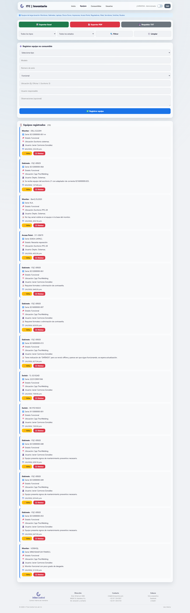
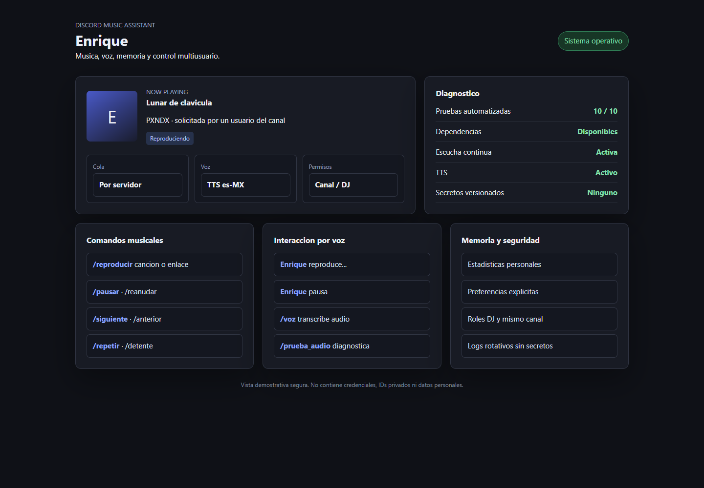
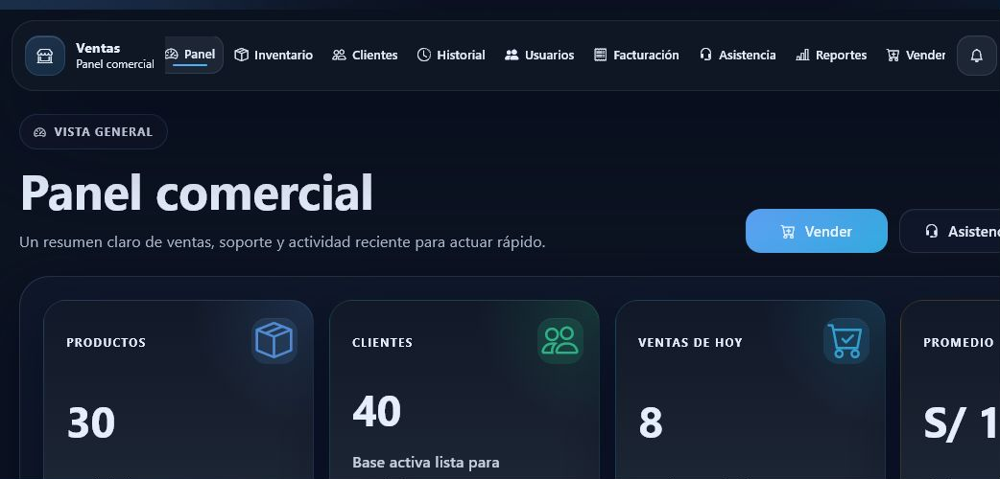

# Portafolio tecnico jcarmona-sys

Este repositorio publico documenta el alcance funcional de los proyectos de
`jcarmona-sys` sin exponer el codigo fuente de los repositorios privados.

La idea es que cualquier persona pueda entender que resuelve cada proyecto,
que modulos incluye, que tecnologia usa y que evidencia visual existe, aunque
el repositorio original permanezca privado por contener logica interna,
integraciones, rutas de red, datos operativos o configuraciones sensibles.

## Repositorios documentados

| Proyecto | Tipo | Estado publico del codigo | Ficha |
| --- | --- | --- | --- |
| ITC | Monorepo de apps internas | Privado | [Ver alcance](projects/itc.md) |
| ITC-DOC | Control documental web | Privado | [Ver alcance](projects/itc-doc.md) |
| Nexo | Asistencia remota | Privado | [Ver alcance](projects/nexo.md) |
| Enrique | Bot musical para Discord | Privado | [Ver alcance](projects/enrique.md) |
| Ventas | Sistema comercial Flask | Privado | [Ver alcance](projects/ventas.md) |
| CreationTools v1 | Utilidades locales Python | Privado | [Ver alcance](projects/creationtools.md) |
| SEDESOQ Residentes Servicio | Prototipo inicial | Publico | [Ver alcance](projects/sedesoq-residentes-servicio.md) |

## Vista rapida

### ITC

Suite interna con resguardos, inventario, visor/editor PDF, operacion WOM web,
formularios OTR/WOD y control documental integrado.

### Nexo

Base de plataforma para asistencia remota con backend FastAPI, autenticacion
JWT, registro de dispositivos, agente de pantalla y visor WebSocket.

### Enrique

Bot musical multiusuario para Discord con cola, comandos slash, voz,
transcripcion local, TTS en espanol, memoria y estadisticas.

### Ventas

Aplicacion web comercial para inventario, clientes, ventas, facturacion,
reportes y usuarios.

## Criterio de publicacion

- No se publica codigo fuente de repos privados.
- No se publican credenciales, tokens, bases de datos, respaldos ni logs.
- Las rutas internas y datos operativos se omiten o se describen de forma
  general.
- Las capturas se usan como evidencia visual del alcance implementado.
- Las fichas se escriben para evaluacion, consulta y presentacion del trabajo.

## Ultima revision

Documentacion generada a partir de los repositorios remotos de GitHub revisados
el 2026-07-07.
