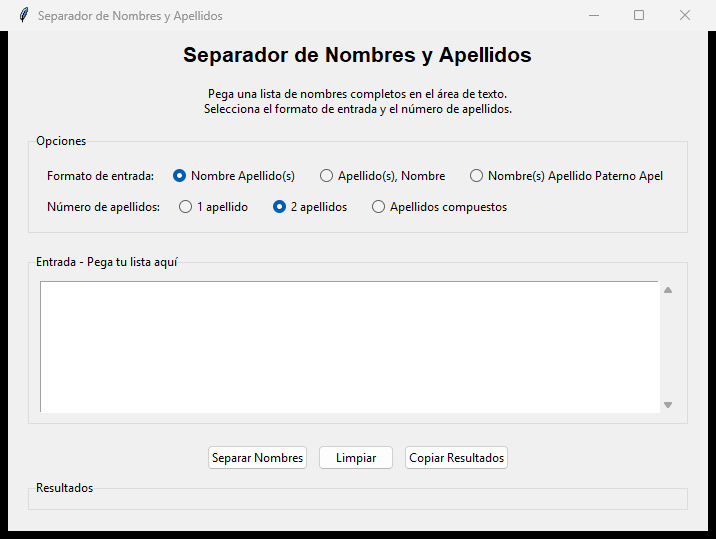

# CreationTools v1

Coleccion de utilidades locales en Python para transformar datos, normalizar
texto y preparar recursos administrativos.

Repositorio original: `jcarmona-sys/CreationToolsv1`  
Visibilidad del codigo: privado

## Herramientas incluidas

| Herramienta | Proposito |
| --- | --- |
| Separador de nombres | Normalizar nombres y dividir componentes |
| Limpieza de textos | Estandarizar texto de origen tabular |
| Creador de correos | Construir nombres y direcciones de correo |
| Filtros | Depurar informacion en archivos de trabajo |
| Firmas HTML | Generar firmas de correo consistentes |
| Envios por lote | Flujos experimentales para automatizacion local |

## Captura

## Casos de uso

- Limpieza y normalizacion de archivos Excel/CSV.
- Preparacion de listados de usuarios.
- Estandarizacion de nombres y correos.
- Generacion de firmas HTML.
- Automatizacion de tareas administrativas repetitivas.

## Stack

| Area | Tecnologia |
| --- | --- |
| Runtime | Python |
| Datos | pandas, openpyxl |
| Interfaz | Tkinter |
| HTML | Beautiful Soup |
| Windows | pywin32 |

## Estado

Coleccion de herramientas internas. El codigo se mantiene privado porque puede
contener flujos de automatizacion y formatos especificos de operacion.
