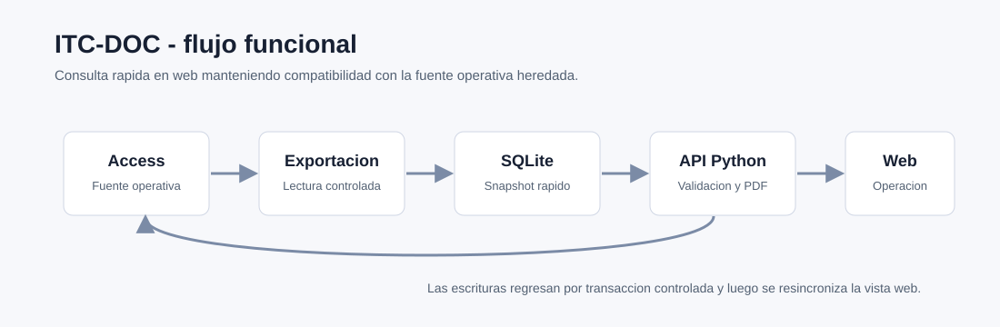

# ITC-DOC

Aplicacion web para control documental, migrada desde una operacion heredada en
Access hacia una arquitectura Python, SQLite y navegador.

Repositorio original: `jcarmona-sys/ITC-DOC`  
Visibilidad del codigo: privado

## Problema que resuelve

Centraliza documentos maestros, revisiones, distribucion, transmittals, ROI,
cartas y catalogos en una interfaz web, conservando compatibilidad con la base
Access operativa.

## Funcionalidades

- Altas, cambios y bajas con validacion.
- Consecutivos para entradas, transmittals, ROI y cartas.
- Relacion documento -> revision -> distribucion.
- Relacion transmittal -> documentos incluidos.
- Bloqueo temporal para evitar ediciones simultaneas.
- Sincronizacion periodica desde la fuente Access hacia SQLite.
- Exportacion CSV.
- Reportes PDF con identidad visual.
- Plantillas Excel e importacion validada.
- Busqueda predictiva, tema claro/oscuro y vista adaptable.
- Bitacora tecnica de operaciones.

## Arquitectura funcional

| Capa | Rol |
| --- | --- |
| Access | Fuente operativa heredada |
| Exportacion | Lectura controlada y construccion de snapshot |
| SQLite | Consulta rapida para la interfaz web |
| API Python | Validacion, bloqueo, reportes y sincronizacion |
| Navegador | Operacion diaria y captura documental |

## Stack

| Area | Tecnologia |
| --- | --- |
| Backend | Python |
| Datos | SQLite como snapshot, Access como fuente operativa |
| Escritura Access | PowerShell DAO |
| Frontend | HTML, CSS y JavaScript sin framework pesado |
| Reportes | PDF corporativo y CSV |
| Calidad | Pruebas unitarias, validacion sintactica y pruebas de navegador |

## Validacion documentada

- Compilacion de backend y generador de reportes.
- Validacion sintactica del frontend.
- Pruebas unitarias de reglas auxiliares y plantillas Excel.
- Pruebas de escritura sobre copia aislada.
- Revision de tema claro/oscuro, formularios, busquedas y vista movil.
- Render de PDF para formatos documentales principales.

## Estado

Aplicacion funcional orientada a operacion interna. La ficha publica omite
rutas de red, nombres de servidor y ubicaciones de bases reales.
