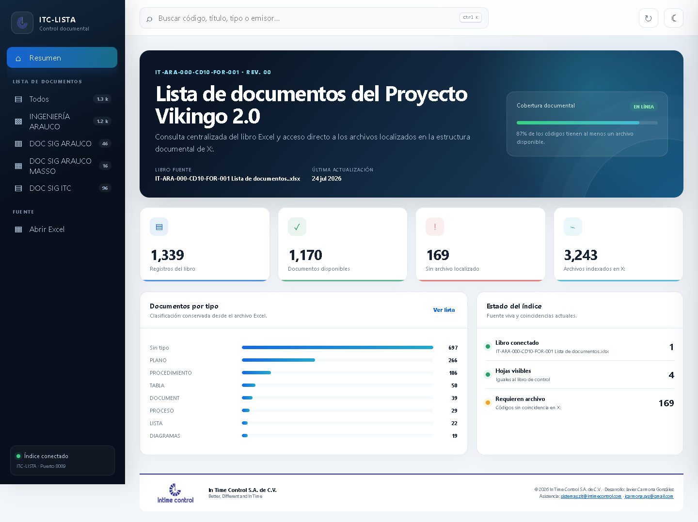
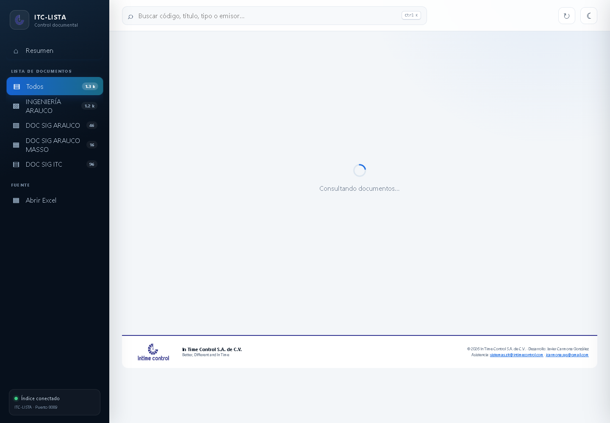
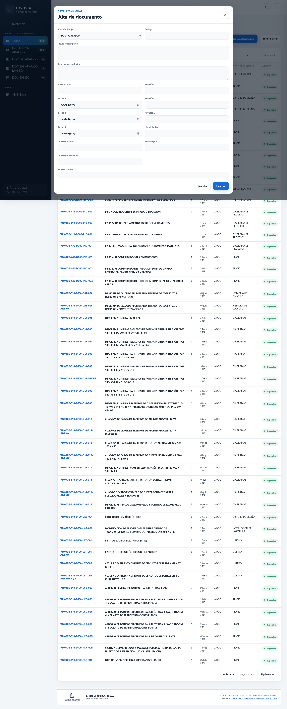
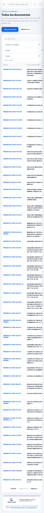

# ITC-DocList

Módulo web de control documental para centralizar el formato maestro, localizar archivos por código y gestionar altas, modificaciones y bajas sin perder cambios al resincronizar la fuente Excel.

Repositorio original: [`jcarmona-sys/ITC`](https://github.com/jcarmona-sys/ITC/tree/main/ITC-ACCDBweb/ITC-DocList)  
Visibilidad del código: privado

## Alcance

- CRUD completo en cada pestaña documental.
- Búsqueda, filtros, paginación y consulta de archivos relacionados.
- Sincronización con Excel y reconstrucción de un índice SQLite.
- Diario de cambios independiente que reaplica altas, ediciones y bajas.
- Auditoría local, tema claro/oscuro y formularios responsive.
- API REST en Python sin dependencias externas de producción.

## Arquitectura

| Capa | Tecnología |
| --- | --- |
| Backend | Python `http.server` y API JSON |
| Persistencia | SQLite: índice regenerable + diario CRUD |
| Fuente | Excel Open XML y estructura documental |
| Interfaz | HTML, CSS y JavaScript sin framework |
| Calidad | `unittest`, compilación Python y validación JavaScript |

## Evidencia visual

| Panel | Documentos |
| --- | --- |
|  |  |

| Formulario CRUD | Vista móvil |
| --- | --- |
|  |  |

## Seguridad

La publicación excluye bases, libros, documentos, logs, rutas de producción, archivos `.env` y credenciales. El módulo se destina a red interna y debe colocarse detrás de autenticación corporativa si se comparte entre usuarios.
