# ITC

Monorepo de aplicaciones internas para digitalizar procesos administrativos,
control operativo y documentos de In Time Control.

Repositorio original: `jcarmona-sys/ITC`  
Visibilidad del codigo: privado

## Alcance

ITC concentra varias aplicaciones que comparten una misma linea operativa:
reducir controles manuales, reemplazar archivos dispersos y dar trazabilidad a
procesos internos.

## Modulos principales

| Modulo | Funcion |
| --- | --- |
| ITC Resguardos | Control de resguardos, firmas, usuarios y PDF de entrega |
| ITC Inventario | Alta, consulta y control de equipos y consumibles |
| ITC IntroPDF | Herramienta desktop para visualizar, organizar y editar PDF |
| ITC ACCDBweb | Operacion web de flujos WOM migrados desde Access |
| OTR/WOD | Captura, consulta y reporte de ordenes/formularios operativos |
| ITC-DOC | Submodulo de control documental web |

## Funcionalidades destacadas

- Autenticacion y control de roles.
- CRUD de inventario, consumibles, usuarios y resguardos.
- Firmas digitales y generacion de PDF corporativo.
- Formularios web responsivos para WOM, OTR y WOD.
- Sincronizacion con bases Access para preservar operacion existente.
- Tema claro/oscuro en modulos web y desktop.
- Pruebas de control, integridad, concurrencia y validacion de PDF.
- Flujo de ramas por ambiente: desarrollo, QA y produccion.

## Stack

| Area | Tecnologia |
| --- | --- |
| Apps web internas | Node.js, Express, HTML, CSS, JavaScript |
| Persistencia local | SQLite |
| WOM / Access web | Python, PowerShell DAO, SQLite, Access ACCDB |
| PDF desktop | Python, PySide6, PyMuPDF, pikepdf |
| Calidad | Pruebas automatizadas, auditoria npm, validacion Python |

## Capturas

### Resguardos

| Acceso | Listado | Usuarios |
| --- | --- | --- |
| 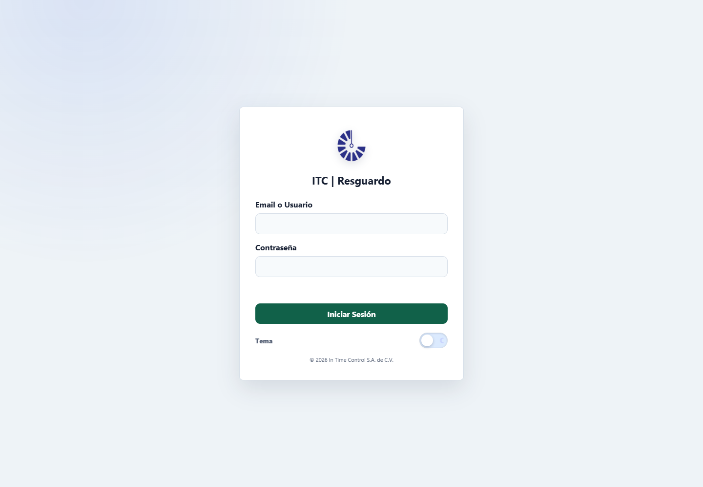 | 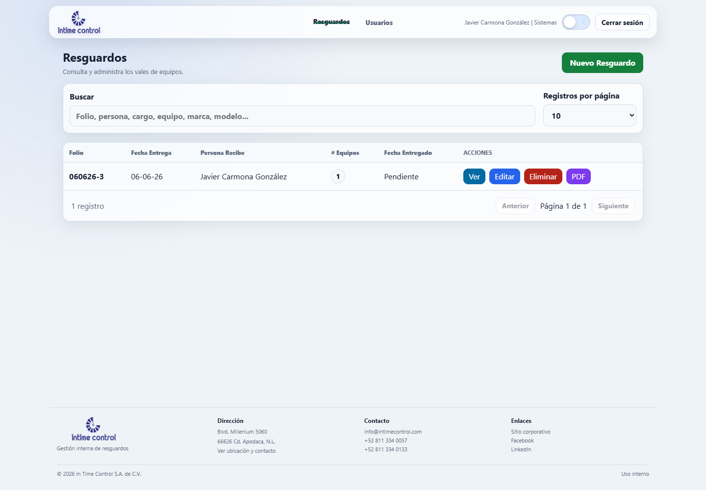 | 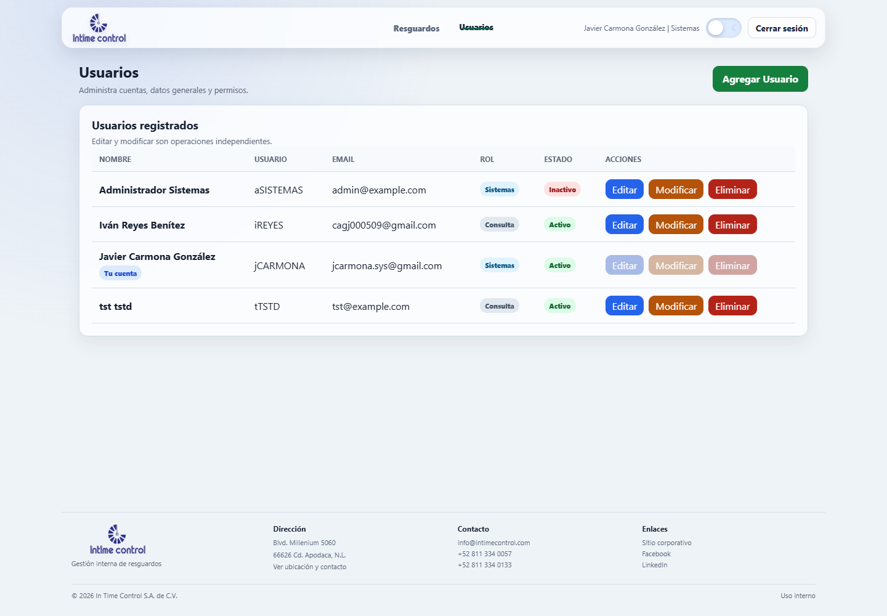 |

### Inventario

| Inicio | Equipos | Consumibles |
| --- | --- | --- |
| 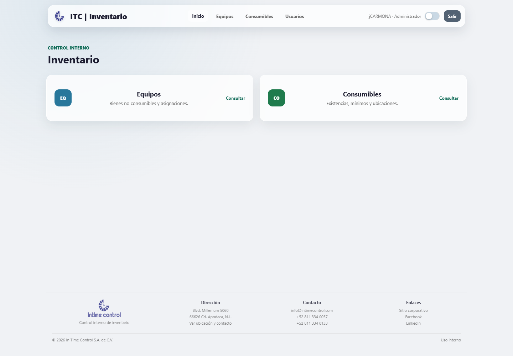 |  | 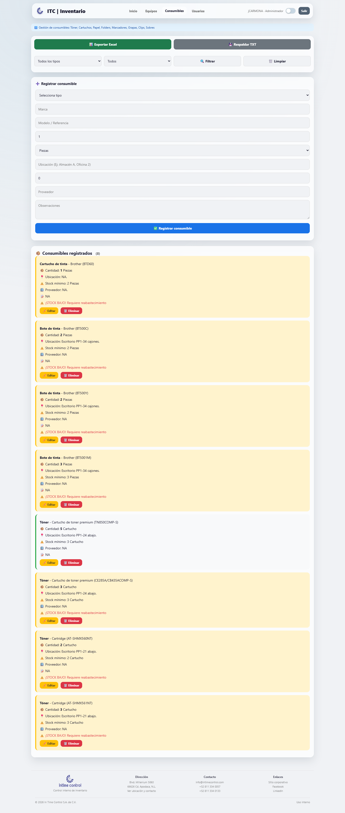 |

### Intro PDF

| Tema oscuro | Tema claro | Comentarios |
| --- | --- | --- |
| 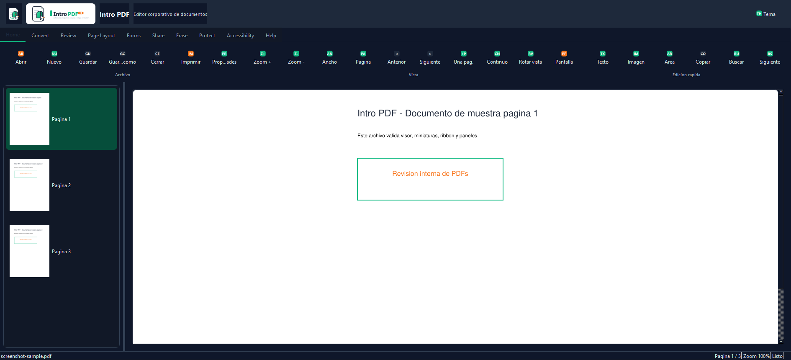 | 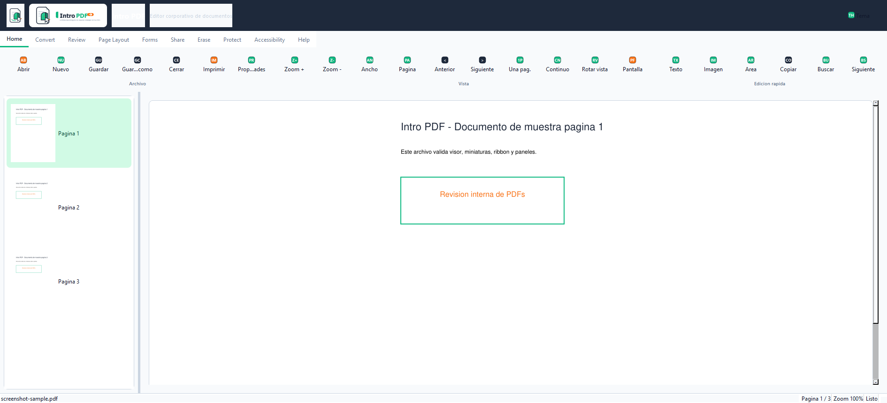 | 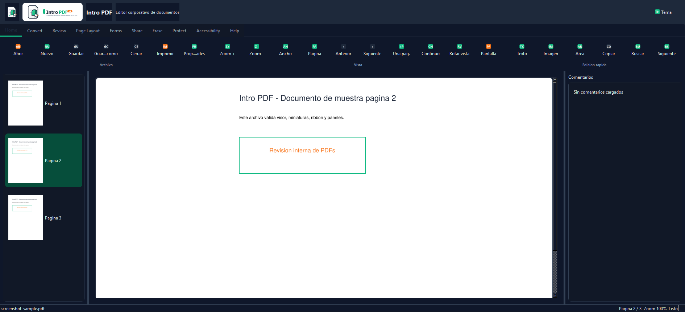 |

### ACCDBweb / WOM

| Lista OTR | Formulario OTR | Formulario WOD |
| --- | --- | --- |
| 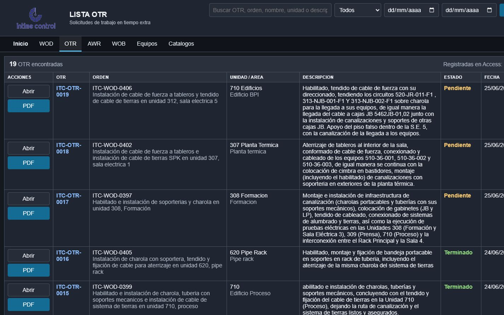 | 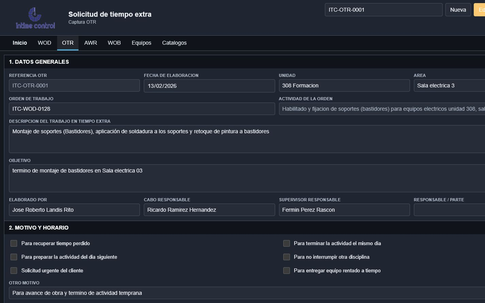 | 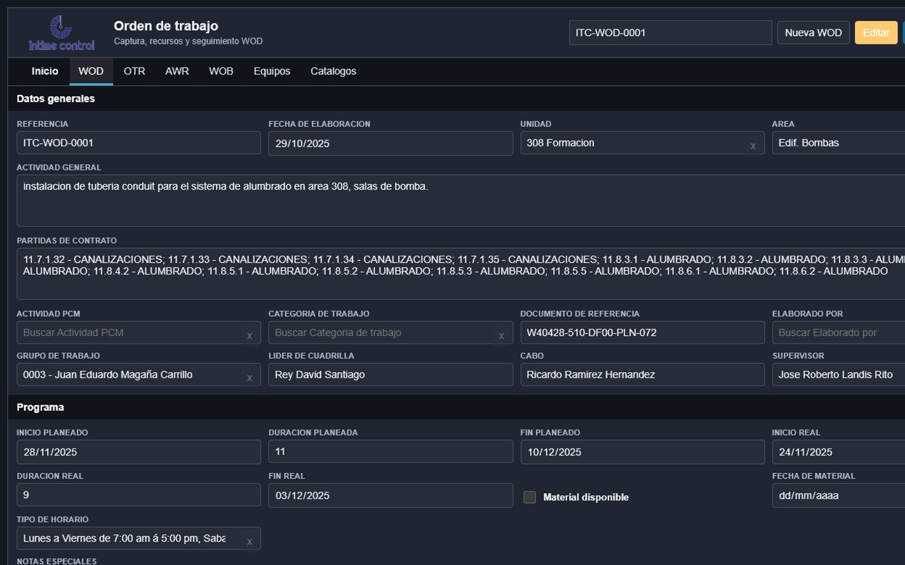 |

## Estado

Proyecto funcional en evolucion. El codigo permanece privado porque integra
procesos internos, rutas de despliegue y conectores con fuentes operativas.
