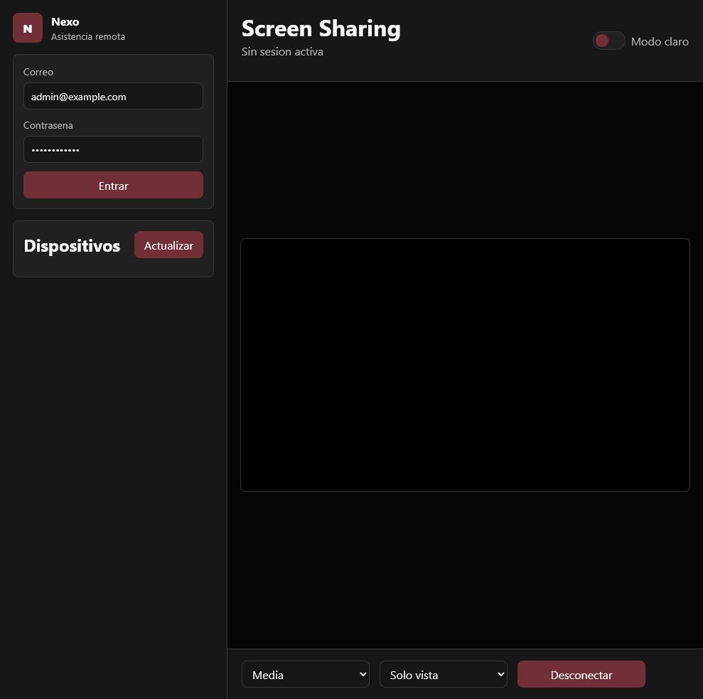
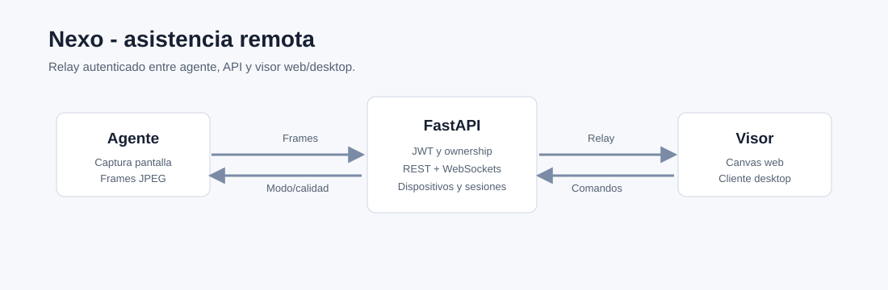

# Nexo

Base de plataforma para asistencia remota, administracion de dispositivos y
visualizacion de pantalla en tiempo real.

Repositorio original: `jcarmona-sys/nexo`  
Visibilidad del codigo: privado

## Alcance

Nexo explora una plataforma propia de soporte remoto con autenticacion,
registro de equipos, visor web, agente de captura y cliente desktop de prueba.

## Funcionalidades

- Backend FastAPI con REST y WebSockets.
- Autenticacion JWT con access token y refresh token.
- Hash de contrasenas con Argon2.
- Modelos de usuario, dispositivo y bitacora de sesiones.
- Registro protegido de dispositivos.
- Limite de sesiones concurrentes por usuario.
- Screen sharing por WebSocket binario.
- Agente que captura pantalla y envia frames JPEG.
- Visor web en canvas con comandos de calidad y modo.
- Cliente desktop Tkinter para operar pruebas sin navegador.
- Documentacion de arquitectura, red y seguridad.

## Captura

## Arquitectura

## Stack

| Area | Tecnologia |
| --- | --- |
| Backend | Python, FastAPI, SQLAlchemy |
| Transporte | REST, WebSockets, frames JPEG binarios |
| Seguridad | JWT, Argon2, ownership por usuario |
| Desktop | Tkinter |
| Frontend | HTML, CSS, JavaScript, canvas |
| Datos | SQLite para desarrollo, migrable a PostgreSQL |

## Siguientes pasos naturales

- Tokens rotables por dispositivo.
- TLS obligatorio en despliegues reales.
- Auditoria completa de sesiones.
- Rate limiting y politicas de rol.
- Relay o WebRTC para escenarios de red mas complejos.

## Estado

Base funcional de desarrollo. El codigo sigue privado porque un sistema de
asistencia remota requiere especial cuidado de seguridad antes de exponerse.
