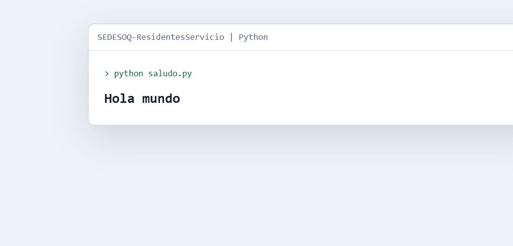

# SEDESOQ Residentes Servicio

Repositorio inicial de exploracion para propuestas relacionadas con residentes
y servicio social.

Repositorio original: `jcarmona-sys/SEDESOQ-ResidentesServicio`  
Visibilidad del codigo: publico

## Alcance actual

Este repositorio conserva planteamientos iniciales y una prueba minima de
ejecucion en Python. Todavia no representa un sistema productivo.

## Contenido

| Recurso | Descripcion |
| --- | --- |
| Planteamientos | Ideas y lineas de trabajo |
| Prueba Python | Ejecucion minima del entorno |
| Documentacion visual | Captura de referencia |

## Captura

## Estado

Prototipo inicial / exploracion.

## Siguiente evolucion posible

- Definir actores y flujo operativo.
- Convertir planteamientos en requerimientos.
- Prototipar formularios y reportes.
- Separar backlog de producto y pruebas tecnicas.
