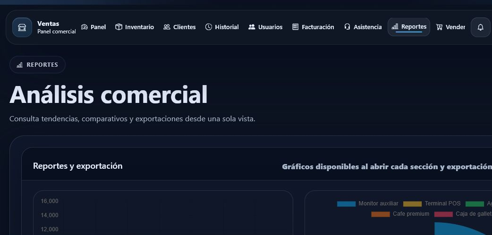

# Sistema de Ventas

Aplicacion web de gestion comercial desarrollada con Flask para centralizar
inventario, clientes, ventas, facturacion, usuarios y reportes.

Repositorio original: `jcarmona-sys/Ventas`  
Visibilidad del codigo: privado

## Funcionalidades

| Modulo | Capacidades |
| --- | --- |
| Panel | Indicadores, actividad reciente y vision general |
| Inventario | Productos, categorias, precios, stock y stock minimo |
| Clientes | Expedientes, contacto e historial comercial |
| Ventas | Captura de operaciones y actualizacion de inventario |
| Facturacion | Comprobantes, tickets PDF y exportaciones |
| Reportes | Tendencias, comparativos y analisis comercial |
| Usuarios | Roles de administrador y vendedor |
| Asistencia | Flujos auxiliares de soporte operativo |

## Capturas

| Dashboard | Login | Reportes |
| --- | --- | --- |
|  |  |  |

## Stack

| Area | Tecnologia |
| --- | --- |
| Backend | Python, Flask |
| ORM | SQLAlchemy |
| Datos | SQLite para demo, MySQL configurable |
| Autenticacion | Flask-Login, bcrypt |
| Documentos | ReportLab, pandas, openpyxl |
| Interfaz | Jinja, HTML, CSS, JavaScript |

## Estado

Demostracion funcional creada como propuesta comercial. No se publica el codigo
privado ni datos de prueba generados localmente.
